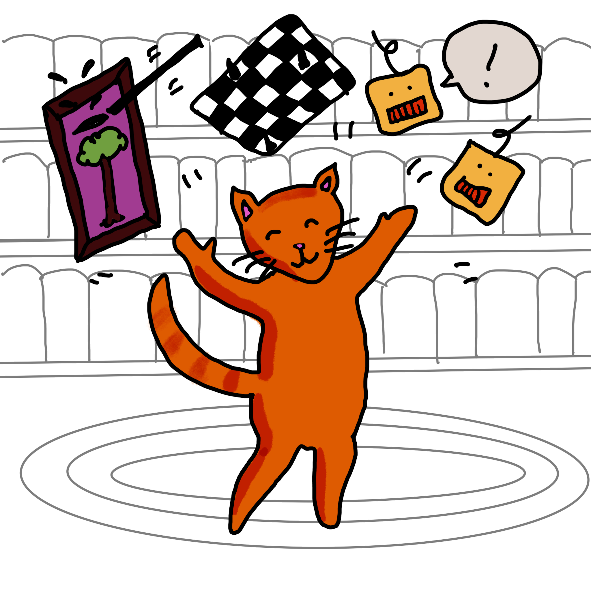

# AI is Everywhere

---

Have you heard of Artificial Intelligence, or 'AI'? AI is already around us. These are the intelligent systems that can help us learn, play, and even create art. Chatbots, for example, can help us connect with people and learn new things. Alpha Go is an example of an AI system that can play complicated computer games against human opponents. And some bots have even been trained to create visual art.

---