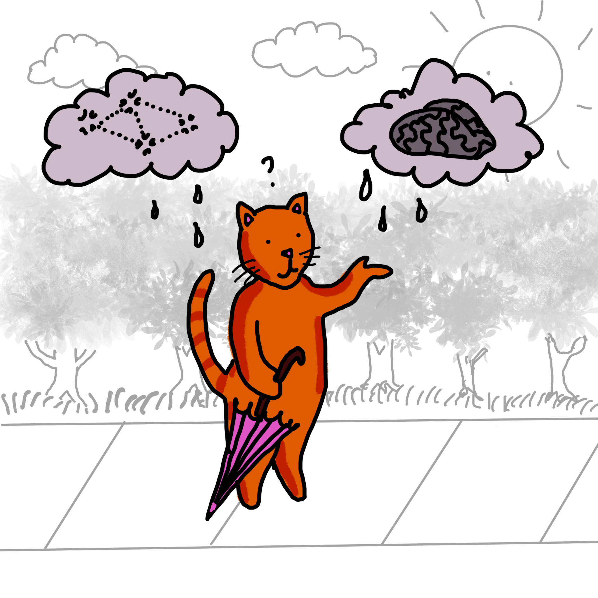

# AI 2 Ways

---

There are two major approaches to AI: Knowledge Representation which is "Top-Down" and Neural Networks which are "Bottom-Up". For example, a top-down rule-based system can decide if you should go to school today based on how you feel, what the lessons are, and if you have done your homework. Neural networks, on the other hand, can recognize how many cats are in a picture or translate from one language to another. Neural networks _learn_ from data, whereas rule-based systems need to extract knowledge from people. 

---