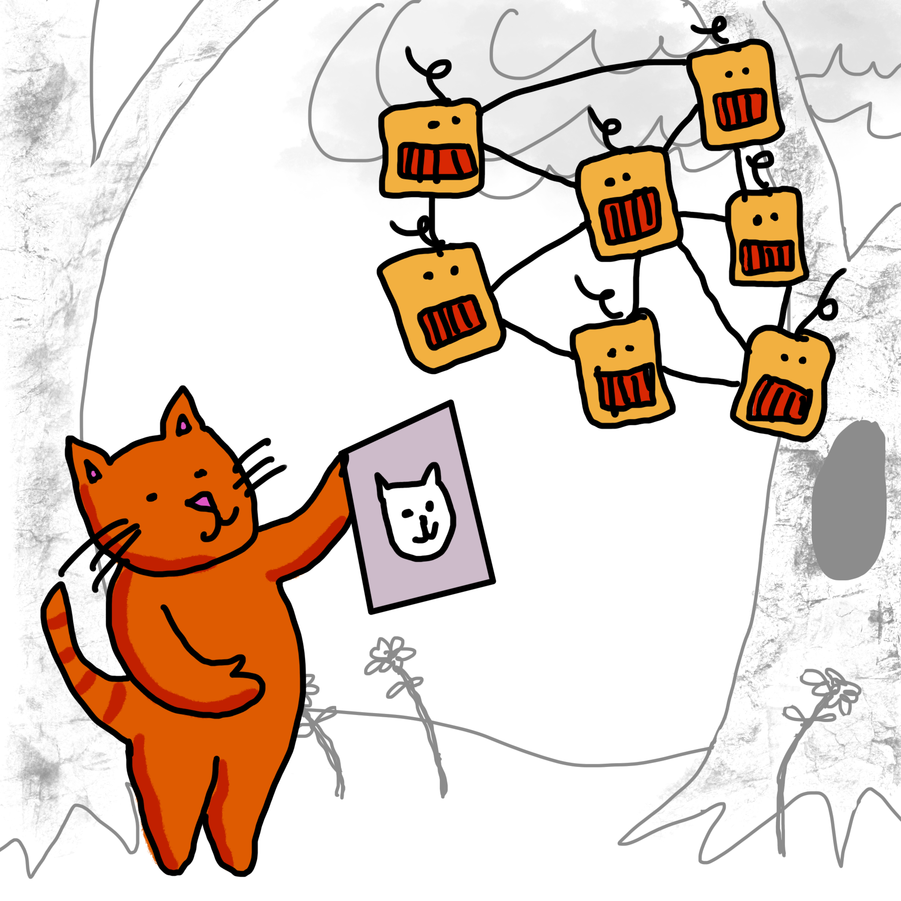

# Neural Networks

---

How do neural networks work? They a collection of electronic neurons, a little similar to the neurons in a human brain. To recognize a cat in a picture, we connect each pixel in the image to a neuron. The number of outputs from this process is the number of outcomes possible. Since cats come in all sizes, shapes, colors, and poses, we need many images to train these neurons to be able to identify a cat. Some pixels are more important than others in the cat pictures, so they are guiven more 'weight' as the neurons work to comprehend the image. The process of 'training' a neural network is actually a process of adjusting these weights. 

 
---