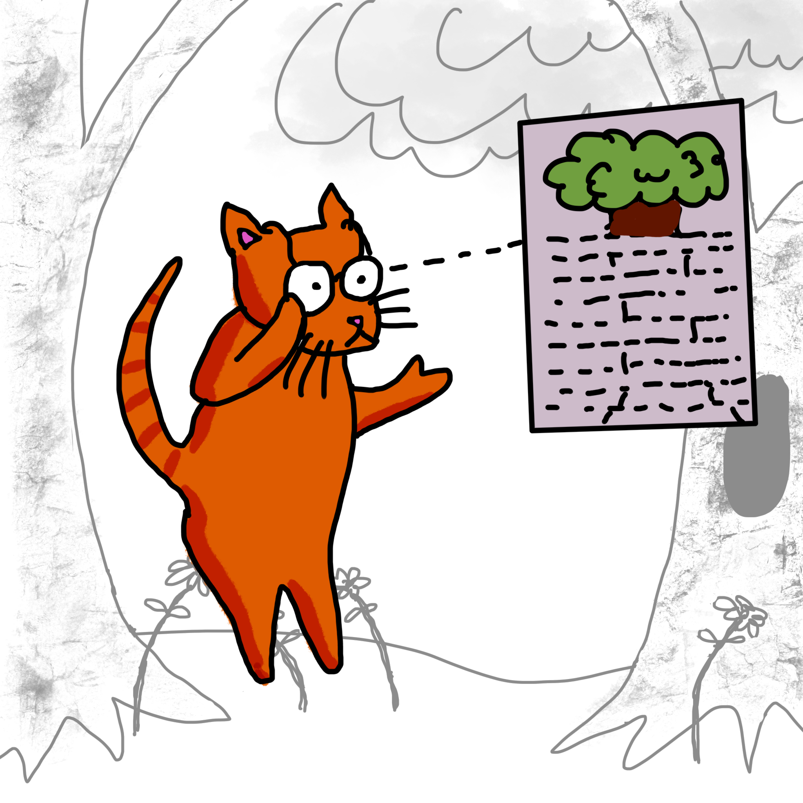

# Convolutional Networks

---

You might hear about a type of neural network called 'Convolutional networks'. These networks extract small patterns that they discover (cats mostly have two eyes and four paws, for example, and trees usually have green leaves and a brown trunk). Then build more complex patterns from these small patterns. This process is similar to the way people behave when looking for a cat in the picture - they scan the picture with their eyes. 

---